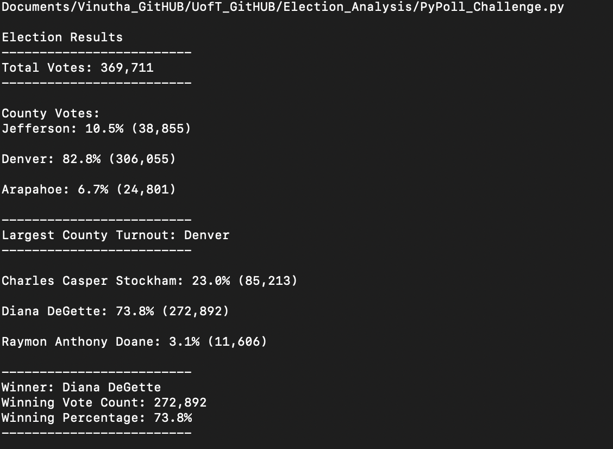

# **Election-Analysis**
- Analyse the election data for Colorado board of elections using Python script.
---
## Overview of the Project
- Complete auditing the election data using Python script for the Colorado board of elections. Election data set provided in the form of csv file.
- Using the python script analyse the data to report the total number of votes in the region, the number of votes and percentage of votes obtained by each county, county which obtained largest number of votes, list of candidates who were voted, total number of votes received by each candidate, percentage of voting for each candidate, winner candidate based on popular vote.
- Based on the success of the analysis in Colorado region with the Python script, leverage the same code to analyse election data of other regions.
## **Election-Audit Results**
- A total of 369,711 votes were casted in the election.
- There were 3 counties which were voted during the election :
    * Jefferson: 10.5% (38,855)
    * Denver: 82.8% (306,055)
    * Arapahoe: 6.7% (24,801)
- The county "Denver" had the largest number of votes of 82.8%.
- The total number of votes and the % of votes gained by each candidate :
    * Charles Casper Stockham: 23.0% (85,213)
    * Diana DeGette: 73.8% (272,892)
    * Raymon Anthony Doane: 3.1% (11,606)
- The clear winner of the election based on popular vote was determined as : Diana DeGette with 272,892 votes which makes up 73.8% of total votes.
- Attached screenshots of the results printed in terminal and .txt file :
---
</img>
---
</img>

## **Election-Audit Summary**
- The python script is robust enough to handle similar election dataset of any other region easily. 
- The script is customised in such a way that it depends directly only on the dataset provided to determine the total election data, fetch the different counties and also identifies the different candidates. 
- Though the size of the data is around 370,000, once the dataset provided is clean, the script takes care of analysing the data in fraction of seconds and presents the final results in a very user-friendly, easily understandable manner.
- If script has to be leveraged to other regions dealing with province, county and sub-counties very minor modification will be needed to roll up or roll down the county information based on the dataset design. 